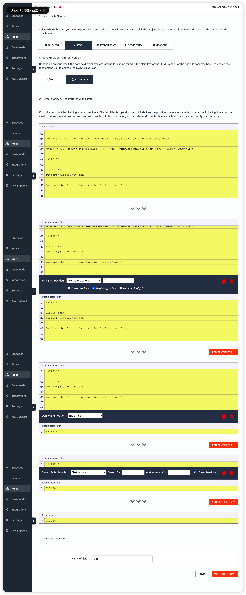

[](https://github.com/mybdye/GxxDOS/actions/workflows/main.yml)
#### ✏️ NOTE
- 11.06
  - 新建
      * 每次运行时间约 1 分钟

#### 🌟️ SUGGESTION
```diff
!自定义schedule
.github/workflows/main.yml

例如：
schedule:
    # UTC (国内 UTC+8)
    - cron: '03 02 */2 * *'   
    # 每2天 10:03am 执行
    
!规则参考
  * * * * *
  | | | | |
  | | | | +----- day of week (0 - 7) (Sunday=0 or 7) OR sun,mon,tue,wed,thu,fri,sat
  | | | +------- month (1 - 12) OR jan,feb,mar,apr ...
  | | +--------- day of month (1 - 31)
  | +----------- hour (0 - 23)
  +------------- minute (0 - 59)
```

#### ㊙️ SECRET
  |YOU SECRET NAME|YOU SECRET VALUE|
  |-----|--|
  |`USERNAME`|你的邮箱|
  |`MAILPARSER`|https://files.mailparser.io/d/xxxxxxxx (需设置 `G**** Authentication` 邮件转发到 mailparser 并设置 pin 解析规则然后新建 json 下载链接)官网：https://app.mailparser.io|
  |`BARK_TOKEN`|(可选) api.day.app/`BARK_TOKEN`/ 详见 https://github.com/Finb/Bark|
  |`TG_BOT_TOKEN`|(可选) `xxxxxx:xxxxxxxxxxxxx`|
  |`TG_USER_ID`|(可选) 给 bot `@userinfobot` 发送 `/start`|

#### 📌 pin (别改其他名字)


#### 📚 THANKS
- [SeleniumBase](https://github.com/seleniumbase)
- [Python](https://www.python.org/)
- [PyCharm CE](https://www.jetbrains.com/pycharm/)
