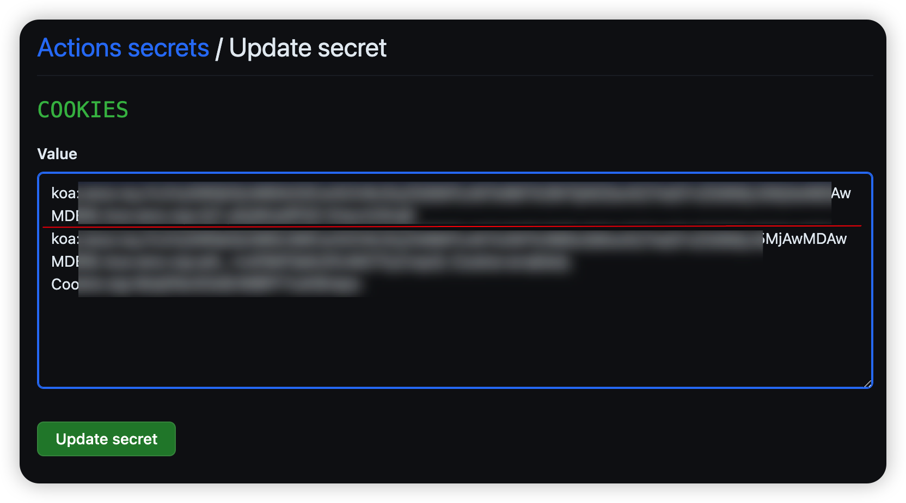
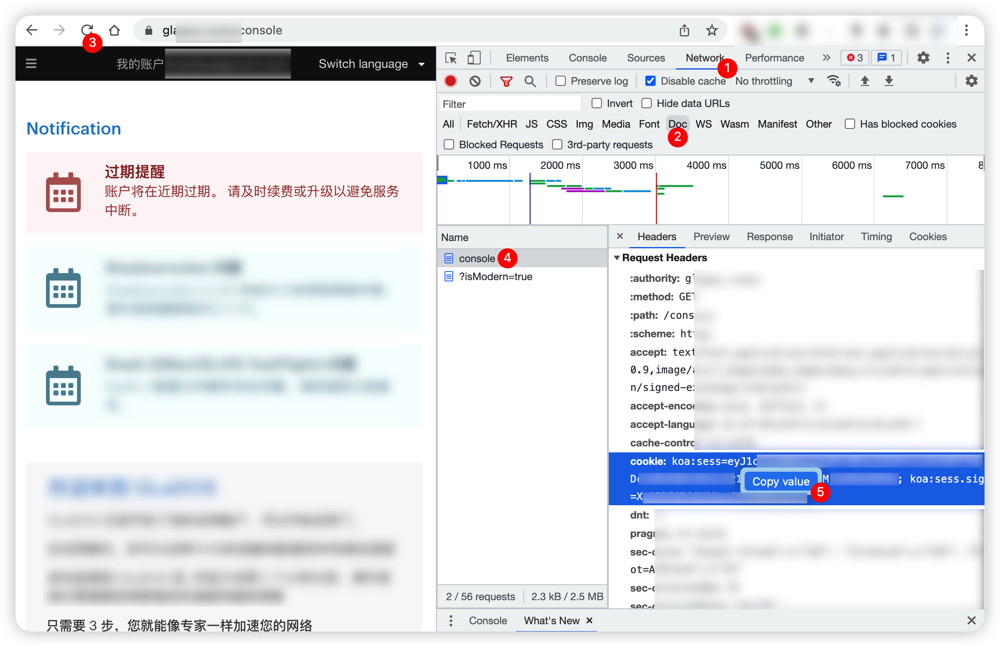

[](https://github.com/mybdye/GlaDxx/actions/workflows/main.yml)

#### ✏️ NOTE
- 2023.07.23 Switch to the api method 🚀
- 2023.04.01 add user traffic info
- 2023.01.19 fix cookie error notification
- 2022.12.22 add expiration judgment
- 2022.12.05 Free users can not checkin anymore, please upgrade to Basic/Pro plan.
- 2022.11.19 some improvements
- 2022.11.08
  - use [json] instead of [replace]
  - remove save_cookies file
- 2022.11.06 first build

#### 🌟️ SUGGESTION
```diff
!自定义schedule
.github/workflows/main.yml

例如：
schedule:
    # UTC (国内 UTC+8)
    - cron: '03 02 */2 * *'   
    # 每2天 10:03am 执行
    
!规则参考
  * * * * *
  | | | | |
  | | | | +----- day of week (0 - 7) (Sunday=0 or 7) OR sun,mon,tue,wed,thu,fri,sat
  | | | +------- month (1 - 12) OR jan,feb,mar,apr ...
  | | +--------- day of month (1 - 31)
  | +----------- hour (0 - 23)
  +------------- minute (0 - 59)
```

#### ㊙️ SECRET
  |YOU SECRET NAME|YOU SECRET VALUE|
  |-----|--|
  |`COOKIES`| cookies，多账户请换行 |
  |`BARK_TOKEN`|(可选) api.day.app/`BARK_TOKEN`/ 详见 https://github.com/Finb/Bark|
  |`TG_BOT_TOKEN`|(可选) `xxxxxx:xxxxxxxxxxxxx`|
  |`TG_USER_ID`|(可选) 给 bot `@userinfobot` 发送 `/start`|
<br>


#### 📌 COOKIES 获取
本地浏览器登陆后,打开开发者工具(F12),按下图顺序获取 <br>
Network > Doc > 刷新 > console > Request Headers > cookie <br> 右键 copy value



#### 📚 THANKS
- [SeleniumBase](https://github.com/seleniumbase)
- [Python](https://www.python.org/)
- [PyCharm CE](https://www.jetbrains.com/pycharm/)
